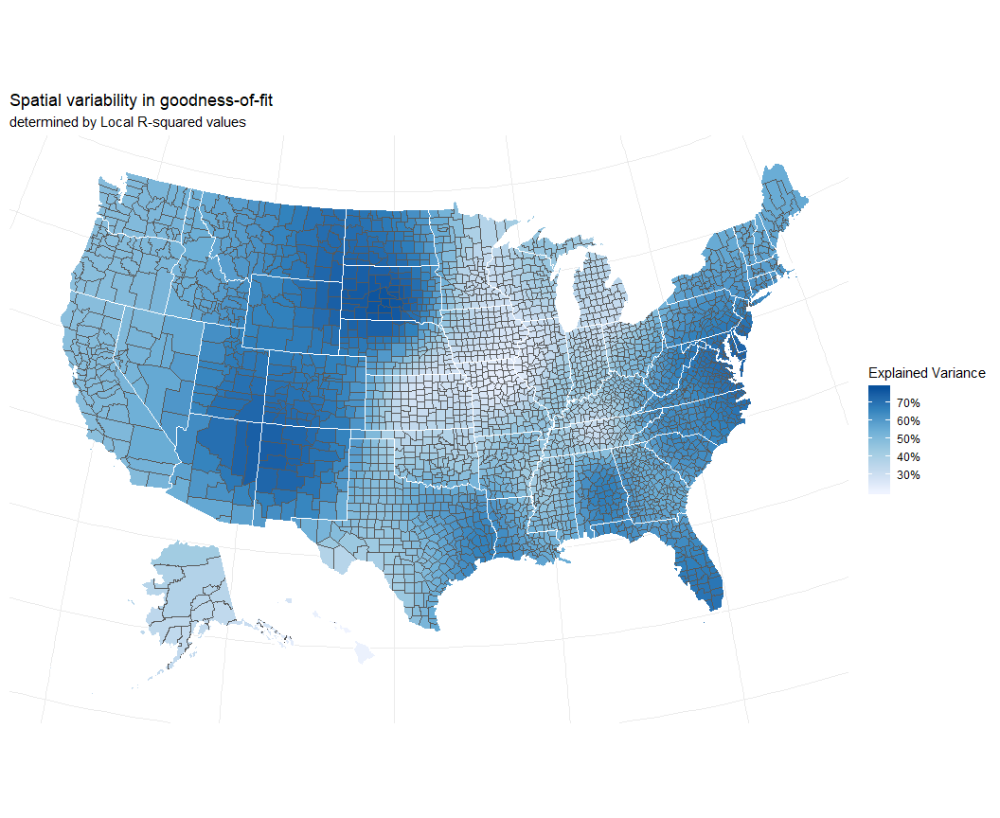
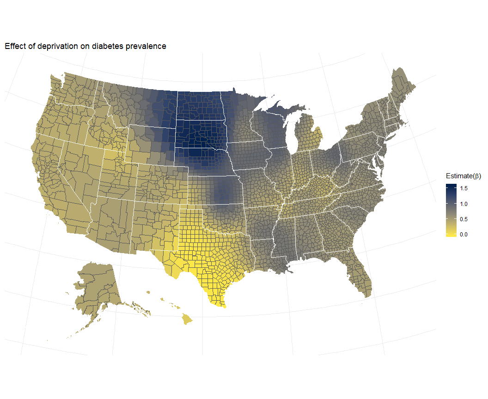

Exploring diabetes indicators across the US
===========================================

A county-level analysis
-----------------------

*WRITE UP IN PROGRESS*

County level deprivation index
------------------------------

Details about the index can be found here: <https://github.com/iecastro/deprivation-index>. In short, estimates are collected from the American Community Survey and a principal component analysis extracts a deprivation score for each observation.

Deprivation index for this project was calculated using 5-year ACS estimates from 2013, at the county-level. Higher index scores represent higher area deprivation relative to all other counties in the US.

Diabetes Indicators
-------------------

National data on diabetes indciators are available from the CDC (<https://www.cdc.gov/diabetes/data/countydata/countydataindicators.html>). Indicator estiamtes are the most up to date as of 2013 and available at the county-level only. Indicators (age-adjusted) are: 1. prevalence of diagnosed diabetes, 2. prevalence of obesity, and 3. prevalence of leisure-time physical inactivity, hereafter just inactivity. The spatial distribution of diabetes prevalence in 2013 (below) parallels that of 2007, which led to the recognition of a "diabetes belt" in southern states (<https://www.scientificamerican.com/article/diabetes-belt/,https://www.ncbi.nlm.nih.gov/pubmed/21406277>).

Data Analysis
-------------

Obesity and physical inactivity are well-known risk factors for developing diabetes. Therefore, in order to assess whether area deprivation is associated with diabetes prevalence, independent of obesity and inactivity, a blocked multiple regression was fitted. First we estimated the effects of obesity and inactivity; afterwards, deprivation variable was introduced.

### Regression results

<table style="border-collapse:collapse; border:none;border-bottom:double;">
<td style="padding:0.2cm; border-top:double;">
 
</td>
<td style="border-bottom:1px solid; padding-left:0.5em; padding-right:0.5em; border-top:double;">
 
</td>
<td style="padding:0.2cm; text-align:center; border-bottom:1px solid; border-top:double;" colspan="4">
Block 1
</td>
<td style="border-bottom:1px solid; padding-left:0.5em; padding-right:0.5em; border-top:double;">
 
</td>
<td style="padding:0.2cm; text-align:center; border-bottom:1px solid; border-top:double;" colspan="4">
Block 2
</td>
</tr>
<tr>
<td style="padding:0.2cm; font-style:italic;">
 
</td>
<td style="padding-left:0.5em; padding-right:0.5em; font-style:italic;">
 
</td>
<td style="padding:0.2cm; text-align:center; font-style:italic; ">
B
</td>
<td style="padding:0.2cm; text-align:center; font-style:italic; ">
CI
</td>
<td style="padding:0.2cm; text-align:center; font-style:italic; ">
std. Error
</td>
<td style="padding:0.2cm; text-align:center; font-style:italic; ">
p
</td>
<td style="padding-left:0.5em; padding-right:0.5em; font-style:italic;">
 
</td>
<td style="padding:0.2cm; text-align:center; font-style:italic; ">
B
</td>
<td style="padding:0.2cm; text-align:center; font-style:italic; ">
CI
</td>
<td style="padding:0.2cm; text-align:center; font-style:italic; ">
std. Error
</td>
<td style="padding:0.2cm; text-align:center; font-style:italic; ">
p
</td>
</tr>
<tr>
<td style="padding:0.2cm; border-top:1px solid; text-align:left;">
(Intercept)
</td>
<td style="padding-left:0.5em; padding-right:0.5em; border-top:1px solid; ">
 
</td>
<td style="padding:0.2cm; text-align:center; border-top:1px solid; ">
-0.91
</td>
<td style="padding:0.2cm; text-align:center; border-top:1px solid; ">
-1.24 – -0.59
</td>
<td style="padding:0.2cm; text-align:center; border-top:1px solid; ">
0.17
</td>
<td style="padding:0.2cm; text-align:center; border-top:1px solid; ">
&lt;.001
</td>
<td style="padding-left:0.5em; padding-right:0.5em; border-top:1px solid; ">
 
</td>
<td style="padding:0.2cm; text-align:center; border-top:1px solid; ">
1.31
</td>
<td style="padding:0.2cm; text-align:center; border-top:1px solid; ">
0.96 – 1.66
</td>
<td style="padding:0.2cm; text-align:center; border-top:1px solid; ">
0.18
</td>
<td style="padding:0.2cm; text-align:center; border-top:1px solid; ">
&lt;.001
</td>
</tr>
<tr>
<td style="padding:0.2cm; text-align:left;">
Obesity Prevelence
</td>
<td style="padding-left:0.5em; padding-right:0.5em;">
 
</td>
<td style="padding:0.2cm; text-align:center; ">
0.19
</td>
<td style="padding:0.2cm; text-align:center; ">
0.17 – 0.20
</td>
<td style="padding:0.2cm; text-align:center; ">
0.01
</td>
<td style="padding:0.2cm; text-align:center; ">
&lt;.001
</td>
<td style="padding-left:0.5em; padding-right:0.5em;">
 
</td>
<td style="padding:0.2cm; text-align:center; ">
0.17
</td>
<td style="padding:0.2cm; text-align:center; ">
0.15 – 0.18
</td>
<td style="padding:0.2cm; text-align:center; ">
0.01
</td>
<td style="padding:0.2cm; text-align:center; ">
&lt;.001
</td>
</tr>
<tr>
<td style="padding:0.2cm; text-align:left;">
Inactivity Prevalence
</td>
<td style="padding-left:0.5em; padding-right:0.5em;">
 
</td>
<td style="padding:0.2cm; text-align:center; ">
0.19
</td>
<td style="padding:0.2cm; text-align:center; ">
0.18 – 0.21
</td>
<td style="padding:0.2cm; text-align:center; ">
0.01
</td>
<td style="padding:0.2cm; text-align:center; ">
&lt;.001
</td>
<td style="padding-left:0.5em; padding-right:0.5em;">
 
</td>
<td style="padding:0.2cm; text-align:center; ">
0.13
</td>
<td style="padding:0.2cm; text-align:center; ">
0.12 – 0.15
</td>
<td style="padding:0.2cm; text-align:center; ">
0.01
</td>
<td style="padding:0.2cm; text-align:center; ">
&lt;.001
</td>
</tr>
<tr>
<td style="padding:0.2cm; text-align:left;">
Area Deprivation
</td>
<td style="padding-left:0.5em; padding-right:0.5em;">
 
</td>
<td style="padding:0.2cm; text-align:center; ">
</td>
<td style="padding:0.2cm; text-align:center; ">
 
</td>
<td style="padding:0.2cm; text-align:center; ">
</td>
<td style="padding:0.2cm; text-align:center; ">
</td>
<td style="padding-left:0.5em; padding-right:0.5em;">
 
</td>
<td style="padding:0.2cm; text-align:center; ">
0.74
</td>
<td style="padding:0.2cm; text-align:center; ">
0.68 – 0.80
</td>
<td style="padding:0.2cm; text-align:center; ">
0.03
</td>
<td style="padding:0.2cm; text-align:center; ">
&lt;.001
</td>
</tr>
<tr>
<td style="padding:0.2cm; padding-top:0.1cm; padding-bottom:0.1cm; text-align:left; border-top:1px solid;">
Observations
</td>
<td style="padding-left:0.5em; padding-right:0.5em; border-top:1px solid;">
 
</td>
<td style="padding:0.2cm; padding-top:0.1cm; padding-bottom:0.1cm; text-align:center; border-top:1px solid;" colspan="4">
3142
</td>
<td style="padding-left:0.5em; padding-right:0.5em; border-top:1px solid;">
 
</td>
<td style="padding:0.2cm; padding-top:0.1cm; padding-bottom:0.1cm; text-align:center; border-top:1px solid;" colspan="4">
3142
</td>
</tr>
<tr>
<td style="padding:0.2cm; text-align:left; padding-top:0.1cm; padding-bottom:0.1cm;">
R2 / adj. R2
</td>
<td style="padding-left:0.5em; padding-right:0.5em;">
 
</td>
<td style="padding:0.2cm; text-align:center; padding-top:0.1cm; padding-bottom:0.1cm;" colspan="4">
.601 / .600
</td>
<td style="padding-left:0.5em; padding-right:0.5em;">
 
</td>
<td style="padding:0.2cm; text-align:center; padding-top:0.1cm; padding-bottom:0.1cm;" colspan="4">
.661 / .660
</td>
</tr>
<tr>
<td style="padding:0.2cm; text-align:left; padding-top:0.1cm; padding-bottom:0.1cm;">
F-statistics
</td>
<td style="padding-left:0.5em; padding-right:0.5em;">
 
</td>
<td style="padding:0.2cm; text-align:center; padding-top:0.1cm; padding-bottom:0.1cm;" colspan="4">
2361.260\*\*\*
</td>
<td style="padding-left:0.5em; padding-right:0.5em;">
 
</td>
<td style="padding:0.2cm; text-align:center; padding-top:0.1cm; padding-bottom:0.1cm;" colspan="4">
2035.008\*\*\*
</td>
</tr>
</table>
Increases in county-level deprivation predict increases in diabetes prevalence.

It's possible that area deprivation is a moderator in the association between obesity and diabetes.

### Interaction Term

Results summary

    ## MODEL INFO:
    ## Observations: 3142 (79 missing obs. deleted)
    ## Dependent Variable: DiabPrev
    ## Type: OLS linear regression 
    ## 
    ## MODEL FIT:
    ## F(4,3137) = 1668.00, p = 0.00
    ## R² = 0.68
    ## Adj. R² = 0.68 
    ## 
    ## Standard errors: OLS
    ##             Est. S.E. t val.    p    
    ## (Intercept) 9.50 0.02 400.02 0.00 ***
    ## InactPrev   0.14 0.01  19.71 0.00 ***
    ## ObPrev      0.16 0.01  22.99 0.00 ***
    ## PC1         0.68 0.03  22.08 0.00 ***
    ## ObPrev:PC1  0.06 0.00  13.90 0.00 ***
    ## 
    ## Continuous predictors are mean-centered.

Spatial Analysis
----------------

All spatial analysis was conducted in ArcMap (version 10.2). A geographically weighted regression (GWR) was fitted with an adapative kernel and AICCc bandwith parameter.

GWR estimates local models across an area by allowing the relationship between variables to vary by location. Inactivity variable was excluded from this model due to multicollinearity with obesity variable.

### Results

The GWR used 404 neighbors for each local estimation and accounted for 80% of variability in diabetes outcome. Local models accounted between 20% to 77% of variability in the outcome.

GWR summary:

Neighbors : 404
ResidualSquares : 3022.5957759565522
EffectiveNumber : 83.492913855248489
Sigma : 0.99411194002147207
AICc : 8921.5582814951449
R2 : 0.80040748447829668
R2Adjusted : 0.79502414949644495

### Spatial variability in the effect of each variable

### Standardized residuals from GWR model

Limitations
-----------
